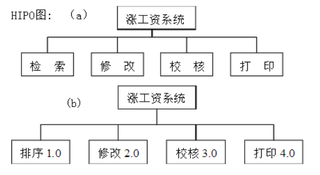
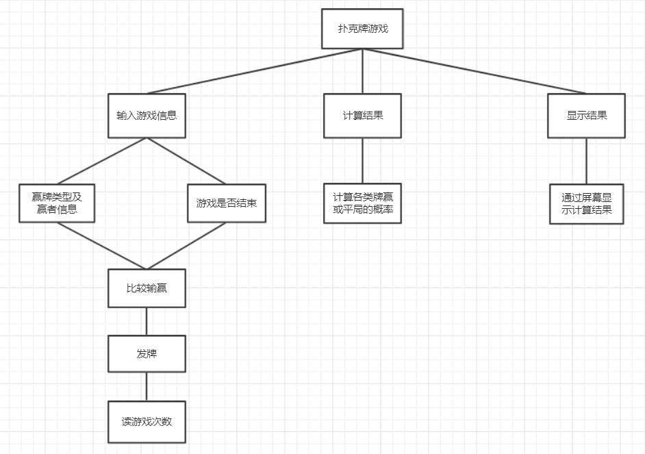

# 第四题与第五题作业目录

### 一、软件说明

1.使用Microsoft Visual Studio 2019开发，开发语言为C#

2.运行环境

windows平台

.Net Framework 4.6.1

### 二、第四题作业

1.需求说明

1）功能需求：可以输入调资的标准，输入教师档案，经调资给出新的教师档案，需要存储档案，当需求发生变化时，该软件应该能够适应这些变化，出现错误时，应给予警告过提示

2）性能需求：软件的响应时间应小于0.5s，更新处理要快

2.数据流图

3.HIPO图

4.演示GIF

**5.说明**

源代码位置：（当前目录下）".\第四题与第五题(可运行程序)\Plugins\P114T4\\"

### 三、第五题作业

1.数据流图

2.软件结构图

3.演示GIF

**4.说明**

源代码位置：（当前目录下）".\第四题与第五题(可运行程序)\Plugins\P114T5\\"

### 四、部分下层目录及文件介绍*

第四题与第五题(可运行程序打包).rar  ·········· 第四题与第五题可运行程序打包，供下载方便

第四题与第五题(可运行程序)  ························ 第四题与第五题可运行程序全部文件及**作业源代码**，供浏览文件

仅主程序与源代码  ········································· 仅主程序及主程序源代码目录（内有打包压缩文件）

